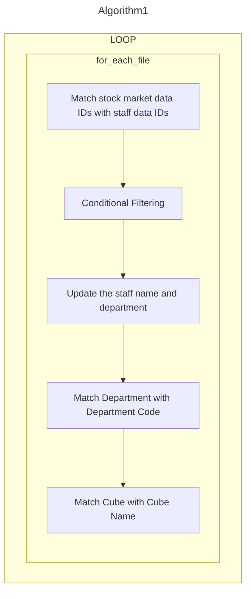
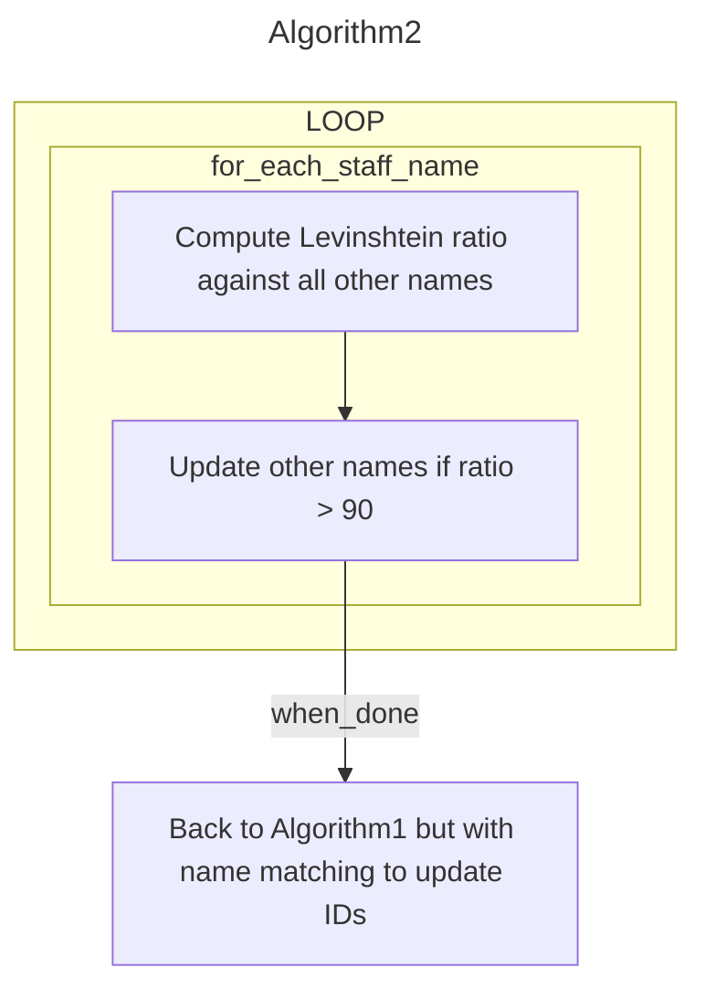
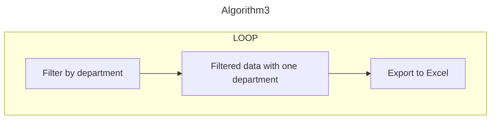
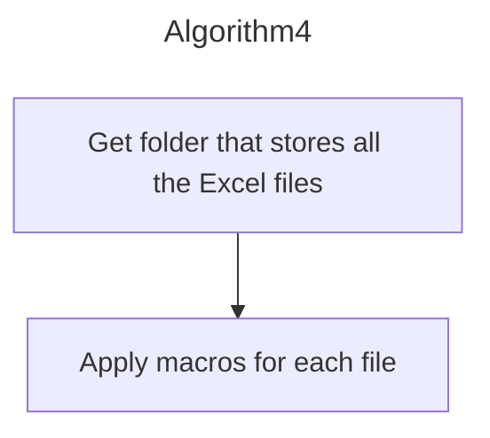

# Package Concepts 🧠

!!! info
        Let's continue to explore on how Travis solved his problems at work 💡

## Travis Umbrella Thinks Differently
### Check What You Have
Let's take a look at the data that Travis is able to gather before starting to compile everything. He currently has a copy of staff data, checklist data (contains abbreviations references used firm wide) and the raw data from the stock markets. 

*Note: The below list shows only a portion of the data*

=== "Staff Data"

    LAN ID | Name | Email | Department
    :-- | -- | --| --:
    R2J0PNN64H944P26B |Vanessa Sanchez | scottkyle@example.com | Google
    95F33XSJ5HEK4WCMX | Jordan Harris | uvasquez@example.net | Google
    4F244SMY5SPZPD94K | Jennifer Jimenez | nathan14@example.net|Google

=== "Checklist 1"

    Department | Dept Code
    :-- | --:
    Google | GOOG
    Apple | AAPL
    Microsoft | MSFT
    Amazon | AMZN

=== "Checklist 2"

    cube | cube_name
    :-- | --:
    791745 | The Midnight Serenade
    692791 | Starlight Dreams
    568621 | City of Whispers
    580051 | Lost in Time

Here is an overview of the raw data.[^1] he collects from the stock markets:

=== "NASDAQ"
    Department | Dept | User ID | Name | Cube
    :-- | -- | --| --| --:
    Google | GOOG | R2J0PNN64H944P26B | NaN | 969122
    Google | NaN | 95F33XSJ5HEK4WCMX | Jordan Harris | 676021
    NaN | GOOG | 4F244SMY5SPZPD94K | Jennifer Jimenez | 322610

=== "NYSE"
    Department | Dept | User ID | Name | STATSMART CUBE
    :-- | -- | --| --| --:
    Microsoft | NaN | UJHCDGW5XVREEHTJ6 | Danielle Knox 
    NaN | MSFT | J9NMAJ9NXRDB8H9VV | Todd Rosales 
    Microsoft | MSFT | LUSH4YFM198L0T17C | NaN 		

=== "SGX"
    Department | Dept | User ID | Name | role code
    :-- | -- | --| -- | --:
    Netflix | NFLX | 987E0H186K7MVTWMC | NaN 
    Netflix | NaN | P6X9P4F89XJVX49B5 | Diamond James 
    NaN| NFLX | 5KVGRVCD65TK6HUEZ | Maria Green 

=== "SSE"
    Department | Dept | User ID | Name | Cube | Disable Flag *
    :-- | -- | --| --| -- | --:
    Spotify | NaN | 81524ER47JWRG1LJ5 | Aaron Brooks| | Y
    Snapchat | SNAP | ZH09GRB41XCBUY5UH | NaN ||Y
    NaN |SNAP | UNX8J7UK4SR394FXW | Valerie Thompson|| Y

=== "TSE"
    Department | Dept | User ID | Name | Cube | Status
    :-- | -- | --| --| --  | --:
    Slack | NaN | WJYSG3S324FG716B2 | Mary Barry ||*ENABLED
    Square | SQ | 5CJLUSHR0ZB7WC1N7 | NaN || *ENABLED

### Identify The Pattern
Travis is quick to find patterns in his collected raw data, he noticed that although there are empty cells about the staff name, department and department code, the staff ID is always recorded whenever transaction is performed. Of course, with the staff data on his hand, he can then learn about the stock that the staff used. 

Moreover, although staff data does not tell him about the department code, but it does tell him the staff department name where he can then make reference to his checklist data for the department code. Well, he can also reference the `cube` code on his checklist for the name of the code.

### Solution
He formulates a plan for his reporting workflows and this algorithm is able to process a majority of his datasets:

But there are still some datasets that still not able to process by his program, so Travis decides to devise a separate algorithm for some non-routine datasets.

## Some Worse Case
!!! warning
    Real world data does not appear to be that clean, let's take a look at some non-routine cases

### Inconsistent Data Entry
Travis noticed that on one of the data he collected from `HKSE` the name of the staff does not match with the company staff directory, for example "Muhamad Ali bin Abu" is named as "Muhamad Ali Abu"; "Lucas Den Shi Ki" is named as "Lucas Shi Ki Den". And in the dataset, there is no IDs column and only name column:

=== "HKSE"
    Name |
    :-- |
    Den Shi Ki Lucas |
    Muhamad Ali Abu |
    Jef A_DriaN |

=== "Actual Name"
    Name |
    :-- |
    Lucas Shi Ki Den |
    Muhamad Ali  bin Abu |
    Jef Adrian |

To resolve this, he has to rely on a metric, called the [Levinshtein](https://en.wikipedia.org/wiki/Levenshtein_distance) ratio that computes the difference between two sequences. Generally if two sequences are exactly the same, the Levinshtein ratio will be 100 and when they gradually differ more in terms of arrangement and alphabets the ratio will decrease. 

What he will do then is he will match all the names in the staff data against the similar names, if the Levinshtein ratio is higher than 90, then the similar names will be replaced with the names in the staff data.

## Finalizing Report

### Time For Export
With all the data being cleaned and labelled, Travis can now start to prepare for his reports. Since all the data are stored as one dataset, he would need to export it as individual Excel files for each stock category:

Now Travis gets all the files he wants, but these files are raw, he'll use VBA to add some formatting to them so that they look nice before submitting to his boss. The good news is he don't really need to do a loop to apply the macros he wrote because the macro can run on the entire specify folder:

### The Output
Here is the output that Travis will get for each of his stock category:

<figure markdown>
  
  <figcaption>Before using macros and after using macros</figcaption>
</figure>

!!! info
    That's the end for the interesting story with Travis. Check out the next page and see the functions that powered Travis' workflows.

[^1]: The raw data shown are generated, and it might look clean to work with, and real world data is often messier and not well organized. The only clean data that Travis have were the staff and checklist data.