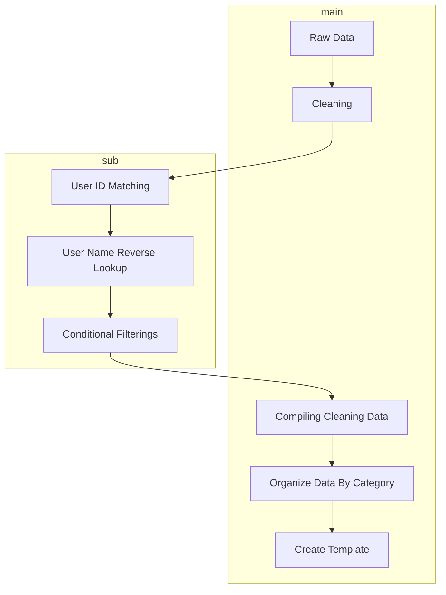

# 👋 Welcome to BlueAutomata 

[](https://keanteng.github.io/blueautomata/)


<figure markdown>
  { width="200" }
  <figcaption>BlueAutomata</figcaption>
</figure>

## Introduction

Reporting is common in financial institution to ensure their operations are compliant and transparent. It also helps in decision-making to build trust, manage risk and informed decision. Workflows for reporting generally involves gathering raw data, cleaning of raw data and compiling raw data into their respective template using Microsoft Excel. For large organization, such procedure can be repetitive, lackluster and time-consuming. Oftentimes, mistakes could be made when dealing with large number of raw data during these processes due to human errors.

Thus, `blueautomata` is introduced as a package to provide a framework to ease the workflow for reporting in a company. This package aims **to automate the workflow of cleaning data, compiling data and preparing the data in reportable format on Excel by auto-calling the corresponding VBA function**.



## Installation
- On Windows Terminal
```py title='Terminal'
py -m pip install blueautomata
```

- Latest development version
```py title='Terminal'
pip install git+https://github.com/keanteng/blueautomata
```

## Package Functions
1. Data Compilation 
   1. Data cleaning such as renaming columns and conditional filtering
   2. Data lookup and matching support
   3. Auto reverse lookup to update mislabelled cells
   4. Auto `fuzzywuzzy` matching for similar data
2. Exports large dataset into categorized files 
3. Template creation for categorized files (report template) by calling written macros on Excel
