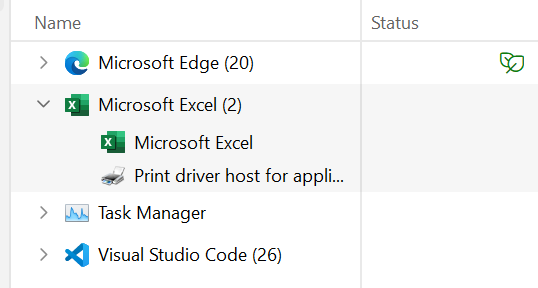

# VBA Integration

!!! info
    To use the package function that support VBA macros make sure to include the following code in your macros

## Macros With Folder Selection

The package supports VBA by calling the Excel macros through Python. Currently, the Python function does not support input parameter for file path to execute the macros on. The function requires the macros to have either a popup for user to select a particular file or folder only.

To allow macros to popup file explorer, you can write you VBA code like this, you just need to add your VBA code to the line below `Replace the line below with the statements you would want your macro to perform`:

```vba title='VBA Code'
Sub AllWorkbooks()
    Dim MyFolder As String 'Path collected from the folder picker dialog
    Dim MyFile As String 'Filename obtained by DIR function
    Dim wbk As Workbook 'Used to loop through each workbook
    On Error Resume Next
    Application.ScreenUpdating = False
    
    'Opens the folder picker dialog to allow user selection
    With Application.FileDialog(msoFileDialogFolderPicker)
    .Title = "Please select a folder"
    .Show
    .AllowMultiSelect = False
    
    If .SelectedItems.Count = 0 Then 'If no folder is selected, abort
        MsgBox "You did not select a folder"
    Exit Sub
    End If
    
    MyFolder = .SelectedItems(1) & "\" 'Assign selected folder to MyFolder
    End With
    MyFile = Dir(MyFolder) 'DIR gets the first file of the folder
    
    'Loop through all files in a folder until DIR cannot find anymore
    Do While MyFile <> ""
    'Opens the file and assigns to the wbk variable for future use
    
    Set wbk = Workbooks.Open(Filename:=MyFolder & MyFile)

    'Replace the line below with the statements you would want your macro to perform

    wbk.Close savechanges:=True
    MyFile = Dir 'DIR gets the next file in the folder
    Loop
    Application.ScreenUpdating = True
End Sub
```

If you call such macros with pop-out window straight from Python, **sometimes the pop-out window will not be shown**, but it will be hidden. To resolve this, go to task manager and open the pop-out window like this (double click the Excel):

<figure markdown>
  
</figure>

After clicking it, you will open a pop-out window for you to select a folder that you want.

!!! warning
    If the file-explorer pop-out window does not show, always go to Task Manger and trigger it, otherwise you macros file will be locked and your Python program will encounter error if you rerun it.

## Some VBA Macros Ideas
Here are some useful functions and tools that can be used to prepare your workbook for reporting:

=== "Formatting"
    Usage | Command
    :-- | --:
    Color a cell | `Range(..).Interior.Color = RGB(..,..,..)`
    Bold a cell | `Range(..).Font.Bold = True`
    Wrap a cell | `Range(..).WrapText = True`
    Merge two cells | `Range(..).Merge True`
    Centering | `Range(..).HorizontalAlignment = xlCenter`

=== "Drop Down"
    Add a drop down box to select `Yes` or `No`
    ```
    Range(..).Validation.Add Type:=xlValidateList, AlertStyle:=xlValidAlertStop, _
    Formula1:="Yes, No"
    ```

=== "Functions"
    Row counter that count how many rows of data in your sheet
    ```
    Function countRow()

    Dim counter As Long
    Dim iRange As Range
    
    With ActiveSheet.UsedRange
        For Each iRange In .Rows
            If Application.CountA(iRange) > 0 Then
                counter = counter + 1
            End If
        Next
    End With
    countRow = counter
    End Function
    ```
